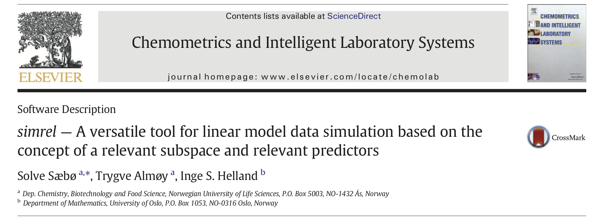

```{r, include = FALSE}
library(knitr)
library(tidyverse)
library(plotly)
library(simrel)
library(pls)
opts_chunk$set(
  comment = NA, fig.align = 'center',
  echo = FALSE, out.width = '100%',
  message = FALSE, warning = FALSE,
  retina = 2, dev = 'svg')
is_latex <- knitr::is_latex_output()
pal <- rev(RColorBrewer::brewer.pal(3, "YlGnBu"))
source("_script/relevant-space.R")
source("_script/var-rect-plot.R")
source("_script/00-function.R")
```

```{r sim_code, echo=FALSE}
set.seed(2018)
sobj <- simrel(
  n = 100, 
  p = 5, m = 3, 
  q = 3, 
  relpos = list(1:2), 
  ypos = list(1), 
  R2 = 0.8, 
  gamma = 0.5, eta = 0, 
  type = "multivariate")
```

## {.flexbox .vcenter}

<div class="notes">
- Hi, my name is Raju. I am from Norwegian University of life sciences.
- I am working on a new estimation method to utilize background information for better prediction as part of my PhD.
- PAUSE
- The Scottish Philosopher Thomas Carlyle, once said that man is a tool-using animal. Without tools he is nothing and with tools he is all.
- For next 20 minutes, I will be talking about a versatile tool for simulation of linear model data called _simrel_ that will help researchers to build, validate and study new methods, algorithm and models.
- I have been working on this with my supervisors Solve Sæbø and Trygve Almøy
</div>


```{r}

```

<blockquote cite="https://www.brainyquote.com/quotes/thomas_carlyle_399446" id="main-quote">
<p class="quotation center">Man is a tool-using animal. Without tools he is nothing, with tools he is all.</p>
<footer>— Thomas Carlyle, Scottish Philosopher</footer>
</blockquote>

## {.flexbox .vcenter}

<div class="notes">
- Hi, my name is Raju. I am from Norwegian University of life sciences.
- I am working on a new estimation method to utilize background information for better prediction as part of my PhD.
- PAUSE
- The Scottish Philosopher Thomas Carlyle, once said that man is a tool-using animal. Without tools he is nothing and with tools he is all.
- For next 20 minutes, I will be talking about a versatile tool for simulation of linear model data called _simrel_ that will help researchers to build, validate and study new methods, algorithm and models.
- I have been working on this with my supervisors Solve Sæbø and Trygve Almøy
</div>


```{r}
knitr::include_graphics("_images/papershot.png")
```

<blockquote cite="https://www.brainyquote.com/quotes/thomas_carlyle_399446" id="main-quote">
<p class="quotation center">Man is a tool-using animal. Without tools he is nothing, with tools he is all.</p>
<footer>— Thomas Carlyle, Scottish Philosopher</footer>
</blockquote>


## Why simrel

```{r comic, out.width='85%'}
knitr::include_graphics("_images/comic-strip.svg")
```

<div class="notes">
- Researchers try to validate and compare their works weather it is a method or an algorithm or a model using simulated data.
- Simulated data gives a control to the researcher to study any unforeseen situation that might occur during implementation.
- But when the specification becomes complex, things starts to get confusing. Researchers spend a lot of time to create these simulated data. 
- This is where the `simrel` helps out in wide range of cases.
</div>

## The Model {.columns-2}

```{r}
set.seed(2018)
sobj2 <- simrel(n = 100, p = 5, m = 3, q = 5, relpos = list(1:5), ypos = list(1:3), 
                R2 = 0.8, gamma = 0.5, eta = 0, type = "multivariate")
```

<div class="notes">
- simrel is an R-package and a shiny application. With few tuning parameters, it lets users to simulated data with wide range of properties.
- Data based on a model is controlled by its covariance structure. For example, a model with 3 responses and 5 predictors has a covariance matrix of 36 unknown numbers that controls the relationship between and within these predictors and responses.
- Here, these off diagonal elements controls the relationship between $X$ and $Y$ and the diagonal matrices controls the variation within them.
</div>

$$
\begin{equation}
\begin{bmatrix}y \\ x \end{bmatrix} \sim \mathcal{N}\left(
\begin{bmatrix}
\mu_y \\ \mu_x
\end{bmatrix},
\underset{(m + p)\times(m + p)}{\begin{bmatrix}
\Sigma_{yy} & \Sigma_{yx}\\
\Sigma_{xy} & \Sigma_{xx}
\end{bmatrix}}
\right)
\end{equation}
$$
There are $\frac{1}{2}(p + m)(p + m + 1)$ unknowns to identify this model.

```{r}
plt1 <- gList(rect_box, labels, titles, arrow_ann[3:4])
grid.newpage()
grid.draw(plt1)
```

<div style="break-before: column;"></div>

equivalently,

$$
\begin{equation}
\mathbf{y} = \beta_0 + \boldsymbol{\beta}^t\mathbf{x} + \boldsymbol{\varepsilon}
\end{equation}
$$

also, we can express, $\boldsymbol{\beta}^t = \Sigma_{xx}^{-1}\Sigma_{xy}$

```{r, fig.width = 3, out.width='100%', fig.asp=0.7}
cov_plot(sobj2, type = "relpred", facetting = FALSE, ordering = FALSE) +
  scale_fill_brewer(palette = "YlGnBu", direction = -1) +
  theme(legend.position = 'none',
        axis.text = element_text(family = "mono"),
        axis.text.x = element_text(angle = 0, hjust = 0.5))
```

## Reduction of Regression Model {.columns-2}

<div class="notes">
- In simrel, we have implemented the concept of relevant components. The concept assumes that there exists a subspace that contains the relevant information and the relevant part of the data is spanned by a subset of principal components.
- Thus, we started by constructing covariance of these relevant and irrelevant principal components. 
</div>

$$\begin{bmatrix}w \\ z \end{bmatrix} \sim \mathcal{N}\left(
\begin{bmatrix}
\mu_w \\ \mu_z
\end{bmatrix},
\underset{(m + p)\times(m + p)}{\begin{bmatrix}
\Sigma_{ww} & \Sigma_{wz}\\
\Sigma_{zw} & \Sigma_{zz}
\end{bmatrix}}
\right)$$

$\frac{1}{2}(p + m)(p + m + 1)$ unknowns can be reduced and parameterized.

```{r}
plt2 <- gList(rect_box, rel_space, titles, labels, in_labels, arrow_ann, bottom_ann_grob)
grid.newpage()
grid.draw(plt2)
```

<div style="break-before: column;"></div>

```{r, fig.asp=1, fig.width = 3.5, out.width='70%'}
set.seed(2018)
sobj2 <- simrel(n = 100, p = 5, m = 3, q = 3, relpos = list(1:2), ypos = list(1), 
                R2 = 0.8, gamma = 0.5, eta = 0, type = "multivariate")
cov_plot(sobj2, type = "relpos", facetting = FALSE, ordering = FALSE) +
  scale_fill_brewer(palette = "YlGnBu", direction = -1) +
  theme(legend.position = 'none',
        axis.text = element_text(family = "mono"),
        axis.text.x = element_text(angle = 0, hjust = 0.5))
```

A subspace in predictor space spanned by subset of _predictor components_ is relevant for the response. Also, only a subspace of response space spanned by subset of _response components_ is informative.
<!--
## Parameterization {.columns-2}

```{r, eval=FALSE, echo = TRUE}
sobj <- simrel(
  n = 100, 
  ##<b>
  p = 5, m = 3, 
  ##</b>
  q = 3, 
  relpos = list(1:2), 
  ypos = list(1), 
  R2 = 0.8, 
  gamma = 0.5, 
  eta = 0, 
  type = "multivariate"
)
```

__We are simulating 5 predictors and 3 responses.__

<div style="break-before: column;"></div>

```{r cov-mat, fig.width = 5, fig.asp=0.7, out.width='100%'}
get_cov_plot <- function(sobj, ncol){
  p1 <- cov_plot(sobj, type = "relpos", facetting = FALSE, ordering = FALSE) +
    scale_fill_brewer(palette = "YlGnBu", direction = -1) +
    theme(legend.position = 'none',
          axis.text = element_text(family = "mono"),
          axis.text.x = element_text(angle = 0, hjust = 0.5)) +
    ggtitle("Covariance Matrix", subtitle = "Principal Components")
  p2 <- cov_plot(sobj, type = "relpred", facetting = FALSE, ordering = FALSE) +
    scale_fill_brewer(palette = "YlGnBu", direction = -1) +
    theme(legend.position = 'none',
          axis.text = element_text(family = "mono"),
          axis.text.x = element_text(angle = 0, hjust = 0.5)) +
    ggtitle("Covariance Matrix", subtitle = "Response and Predictors")
  gridExtra::grid.arrange(p1, p2, ncol = ncol) 
}
get_cov_plot(sobj, 2)
```

The only unknowns are the non-white squares of left plot which is sampled from a standard normal distribution that satisfies all the parameters settings given by the user.

## Parameterization {.columns-2}

```{r, eval=FALSE, echo = TRUE}
sobj <- simrel(
  n = 100, 
  ##<b>
  p = 5, m = 3, 
  q = 3, 
  ##</b>
  relpos = list(1:2), 
  ypos = list(1), 
  R2 = 0.8, 
  gamma = 0.5, 
  eta = 0, 
  type = "multivariate"
)
```

We are simulating 5 predictors and 3 responses. __Out of 5, only 3 predictors in the simulated data need to be relevant to the response.__

<div style="break-before: column;"></div>

```{r cov-mat, fig.width = 5, fig.asp=0.7, out.width='100%'}
```

The only unknowns are the non-white squares of left plot which is sampled from a standard normal distribution that satisfies all the parameters settings given by the user.

## Parameterization {.columns-2}

```{r, eval=FALSE, echo = TRUE}
sobj <- simrel(
  n = 100, 
  ##<b>
  p = 5, m = 3, 
  q = 3, 
  relpos = list(1:2), 
  ##</b>
  ypos = list(1), 
  R2 = 0.8, 
  gamma = 0.5, 
  eta = 0, 
  type = "multivariate"
)
```

We are simulating 5 predictors and 3 responses. Out of 5, only 3 predictors in the simulated data need to be relevant to the response. __These three relevant predictors is spanned by the principal components 1 and 2.__

<div style="break-before: column;"></div>

```{r cov-mat, fig.width = 5, fig.asp=0.7, out.width='100%'}
```

The only unknowns are the non-white squares of left plot which is sampled from a standard normal distribution that satisfies all the parameters settings given by the user.

## Parameterization {.columns-2}

```{r, eval=FALSE, echo = TRUE}
sobj <- simrel(
  n = 100, 
  p = 5, m = 3, 
  q = 3, 
  relpos = list(1:2), 
  ##<b>
  ypos = list(1), 
  R2 = 0.8, 
  ##</b>
  gamma = 0.5, 
  eta = 0, 
  type = "multivariate"
)
```

__The only response components has coefficient of determination of 0.8. Which is also true for the first response variable.__

<div style="break-before: column;"></div>

```{r cov-mat, fig.width = 5, fig.asp=0.7, out.width='100%'}
```

The only unknowns are the non-white squares of left plot which is sampled from a standard normal distribution that satisfies all the parameters settings given by the user.

## Parameterization {.columns-2}

```{r, eval=TRUE, echo = -1}
set.seed(2018)
sobj <- simrel(
  n = 100, 
  p = 5, m = 3, 
  q = 3, 
  relpos = list(1:2), 
  ##<b>
  ypos = list(1:3), 
  R2 = 0.8, 
  ##</b>
  gamma = 0.5, 
  eta = 0, 
  type = "multivariate"
)
```

The only response components has coefficient of determination of 0.8. Which is also true for the first response variable. __Mixing this with others blends the information in all response variables.__

<div style="break-before: column;"></div>

```{r cov-mat-1, fig.width = 5, fig.asp=0.7, out.width='100%'}
get_cov_plot(sobj, 2)
```

The only unknowns are the non-white squares of left plot which is sampled from a standard normal distribution that satisfies all the parameters settings given by the user.


## Parameterization {.columns-2}

```{r, eval=TRUE, echo = -1}
set.seed(2018)
sobj <- simrel(
  n = 100, 
  p = 5, m = 3, 
  q = 3, 
  relpos = list(1:2), 
  ypos = list(1:3), 
  R2 = 0.8, 
  ##<b>
  gamma = 0.5, 
  eta = 0, 
  ##</b>
  type = "multivariate"
)
```

In simrel, one parameter controls the __exponential decay of eigenvalues__ which consequently __controls the multicollinearlity__ in the data as well as the __correlation between the response variables__.

<div style="break-before: column;"></div>

```{r cov-mat-1, fig.width = 5, fig.asp=0.7, out.width='100%'}
```

The non-white squares in the diagonals of left plot are the eigenvalues.

## Parameterization {.columns-2}

```{r, eval=TRUE, echo = -1}
set.seed(2018)
sobj <- simrel(
  n = 100, 
  p = 5, m = 3, 
  q = 3, 
  relpos = list(1:2), 
  ypos = list(1:3), 
  R2 = 0.8, 
  ##<b>
  gamma = 0.5, 
  eta = 0, 
  ##</b>
  type = "multivariate"
)
```

In simrel, one parameter controls the __exponential decay of eigenvalues__ which consequently __controls the multicollinearlity__ in the data as well as the __correlation between the response variables__.

<div style="break-before: column;"></div>

<div id="gamma-eqn" style="position: absolute; top: 15%; left: 70%; z-index: 1;">
$$\lambda_i = e^{-\gamma (i - 1)}$$
</div>

```{r plotly}
source("_script/gamma-animation.r", local = TRUE)
ggplotly(static_plt) %>%
  config(displayModeBar = FALSE) %>%
  animation_opts(
    800, easing = "elastic", redraw = TRUE
  ) %>%
  animation_button(
    x = 1, xanchor = "right", y = 0, yanchor = "bottom",
    borderwidth = 0, bgcolor = 'transparent',
    font = list(family = "monospace", size = 32, color = "#afafaf")
  ) %>%
  animation_slider(
    currentvalue = list(
      x = 1, xanchor = 'right', y = 0, yanchor = 'bottom',
      prefix = "gamma: ", font = list(color = "grey"))
  )
```

## Accessing Properties of Data {.columns-3}

```{r, fig.width=4}
ggsimrelplot(sobj, which = 1)
```

Relevant predictors have non-zero coefficients (`r sort(unname(unlist(sobj$relpred)))`).

<div style="break-before: column;"></div>


```{r, fig.width=4}
ggsimrelplot(sobj, which = 2)
```

Predictor components `r unlist(sobj$relpos)` are relevant to first response component.

<div style="break-before: column;"></div>

```{r, fig.width=4}
ggsimrelplot(sobj, which = 3)
```

The properties propagate to related response variables in simulated data.
-->

# [Shiny App](http://localhost:5555) {.light}
<!--
# {data-background=_images/ss-01.png data-background-size=cover}
# {data-background=_images/ss-02.png data-background-size=cover}
# {data-background=_images/ss-03.png data-background-size=cover}
# {data-background=_images/ss-04.png data-background-size=cover}
-->
## Application of simrel {.columns-2}

```{r}
library(RefManageR)
bib_file <- ReadBib("references.bib")
```

<div id="app-research">
<h3>Research</h3>
Most of the research papers use simulated data. Here are just few mentions:

```{r, results='asis'}
bib_out <- sapply(bib_file[c(6, 15, 18, 31)], function(x) {
  paste0("\n- ", x$title, " [@", x$key, "]")
})
cat(bib_out)
```

</div>

<div style="break-before: column;"></div>

<h3>Education</h3>
- __Teaching Statistics__
- __Creating Examples__

<div id="get-started">
<h3>Let's Get Started</h3>
</div>

## An Example (comparison of two estimators) {.columns-2}
```{r example-sim, echo = -1}
set.seed(2018)
design <- crossing(
  gamma = c(0.1, 1.2),
  relpos = c("1:5", "5:9")) %>% 
  mutate(relpos = map(
    relpos, ~eval(parse(text = .x))),
    sim_obj = map2(gamma, relpos, 
      ## <b>
      ~simrel(
        n      = 500,
        p      = 10, m = 3,
        q      = 10,
        relpos = list(.y),
        ypos   = list(1:3),
        gamma  = .x,
        eta    = 0, R2 = 0.8,
        type   = "multivariate"
      )
      ## </b>
    ))
```

<div style="break-before: column;"></div>

```{r}
ce <- design %>% 
  mutate(relpos = map_chr(relpos, ~deparse(unlist(.x)))) %>% 
  group_by(gamma, relpos) %>% 
  transmute(pcr = map(sim_obj, coef_errors, "PCR"),
            pls = map(sim_obj, coef_errors, "PLS2"))
est_error <- ce %>% 
  mutate_at(-c(1:2), map, "prediction_error") %>% 
  gather(method, est_err, pcr,pls) %>% 
  unnest()
pred_error <- ce %>% 
  mutate_at(-c(1:2), map, "estimation_error") %>% 
  gather(method, pred_err, pcr, pls) %>% 
  unnest()
error_df <- pred_error %>% 
  left_join(est_error) %>% 
  rename(Prediction = Pred_Error, Estimation = Est_Error) %>% 
  gather(error_type, error, Prediction, Estimation) %>% 
  group_by(method, Tuning_Param, error_type, add = TRUE) %>% 
  summarize_at("error", sum) %>% 
  ungroup() %>% 
  mutate(gamma = case_when(
    gamma == 0.1 ~ 'Low',
    gamma == 1.2 ~ 'High'
  ))
```

```{r}
gamma_label <- function(string) paste("Multicollinearity:", string)
filter_plt <- function(df, fltr_chr){
  df %>% filter_(fltr_chr) %>% 
  ggplot(
  mapping = aes(
    Tuning_Param, error, 
    color = method,
    group = interaction(relpos, gamma, method))) +
  geom_line() + geom_point() +
  facet_grid(error_type ~ gamma, scales = "free",
             labeller = labeller(gamma = gamma_label)) +
  labs(x = "Number of Components", y = "Error", 
       color = "Method", alpha = "Position of relevant component") +
  theme(legend.position = "top") +
  scale_color_brewer(palette = "Set1", labels = toupper) +
  scale_x_continuous(breaks = seq(0, 10, 2))
}
```

```{r design-print}
design %>% mutate_at("relpos", map_chr, deparse)
```

### Estimator under comparison

- Principal Component Regression (PCR)
- Partial Least Squares (PLS)

## An Example

```{r, fig.width=8, out.width='100%', fig.asp = 0.5}
filter_plt(error_df, 'relpos == "1:5"') +
  ggtitle("Relevant Principal Components are at 1:5")
```

## An Example

```{r, fig.width=8, out.width='100%', fig.asp = 0.5}
filter_plt(error_df, 'relpos == "5:9"') +
  ggtitle("Relevant Principal Components are at 5:9")
```


## Shiny Application and Installation {.flexbox .vcenter}

<div id="installation-wrapper">

<div id="installation">
<h3>Install R-package:</h3>

```{r, eval = FALSE, echo = TRUE}
if (!require(devtools)) install.packages("devtools")
devtools::install_github("simulatr/simrel")
```

<h3>Run Shiny Application</h3>

```{r, eval = FALSE, echo = TRUE}
if (!require(simrel)) install.packages("simrel")
shiny::runGitHub("simulatr/AppSimulatr")
```

</div>

<div>

```{r, out.extra="id='simrel-hex'", fig.asp=1, out.width='100%'}
knitr::include_graphics('_images/simrel-hex.svg')
```

</div>
</div>

## Acknoledgement {.columns-2}

<div class="card-container">
<div class="person">
<div class="image">

</div>
<div class="name">
<h3>Solve Sæbø</h3>
<p>NMBU</p>
</div>
</div>
<div class="person">
<div class="image">

</div>
<div class="name">
<h3>Trygve Almøy</h3>
<p>BioStatistics, NMBU</p>
</div>
</div>
</div>


<div style="break-before: column;"></div>

<div class="thank-you-container">
<h3>Thank You</h3>
<div id="extra-thanks">

<p style="padding-top: 25px">For the opportunity</p>
</div>
</div>

```{r, include = !is_latex, results='asis', echo=FALSE}
cat("## {data-background='_images/ThankYou.png' data-background-position='center' data-background-size='100% 100%'}")
```


```{r, out.width='100%', eval = is_latex, results='asis', echo = FALSE}
cat("## {.plain}")

```

## References  {.small}
