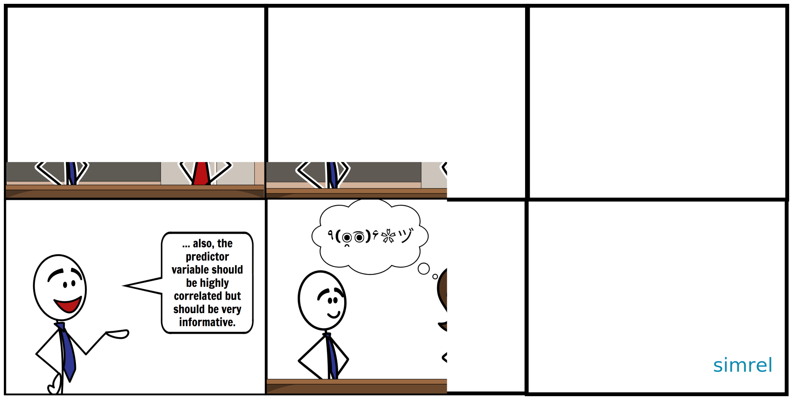

```{r, include = FALSE}
library(knitr)
library(tidyverse)
library(plotly)
library(simrel)
library(pls)
opts_chunk$set(
  comment = NA, fig.align = 'center',
  echo = FALSE, out.width = '100%',
  message = FALSE, warning = FALSE,
  retina = 2, dev = 'svg')
is_latex <- knitr::is_latex_output()
col_vec <- rev(RColorBrewer::brewer.pal(3, "Set2"))
rel_col <- alpha(col_vec[3], 1)
irrel_col <- alpha(col_vec[2], 0.4)
source("_script/relevant-space.R")
source("_script/var-rect-plot.R")
source("_script/00-function.R")
```

```{r sim_code, echo=FALSE}
set.seed(2018)
sobj <- simrel(
  n = 100,
  p = 5, m = 3,
  q = 3,
  relpos = list(1:2),
  ypos = list(1),
  R2 = 0.8,
  gamma = 0.5, eta = 0,
  type = "multivariate")
```

## {.flexbox .vcenter}

<div class="notes">
- Hi, my name is Raju. I am from Norwegian University of life sciences.
- I am working on a new estimation method to utilize background information for better prediction as part of my PhD.
- PAUSE
- The Scottish Philosopher Thomas Carlyle, once said that man is a tool-using animal. Without tools he is nothing and with tools he is all.
- For next 20 minutes, I will be talking about a versatile tool for simulation of linear model data called _simrel_ that will help researchers to build, validate and study new methods, algorithm and models.
- I have been working on this with my supervisors Solve Sæbø and Trygve Almøy
</div>


```{r}
knitr::include_graphics("_images/simrel-papershot.png")
```

<blockquote cite="https://www.brainyquote.com/quotes/thomas_carlyle_399446" id="main-quote">
<p class="quotation center">Man is a tool-using animal. Without tools he is nothing, with tools he is all.</p>
<footer>— Thomas Carlyle, Scottish Philosopher</footer>
</blockquote>

## {.flexbox .vcenter}

<div class="notes">
- Hi, my name is Raju. I am from Norwegian University of life sciences.
- I am working on a new estimation method to utilize background information for better prediction as part of my PhD.
- PAUSE
- The Scottish Philosopher Thomas Carlyle, once said that man is a tool-using animal. Without tools he is nothing and with tools he is all.
- For next 20 minutes, I will be talking about a versatile tool for simulation of linear model data called _simrel_ that will help researchers to build, validate and study new methods, algorithm and models.
- I have been working on this with my supervisors Solve Sæbø and Trygve Almøy
</div>


```{r}
knitr::include_graphics("_images/papershot.png")
```

<blockquote cite="https://www.brainyquote.com/quotes/thomas_carlyle_399446" id="main-quote">
<p class="quotation center">Man is a tool-using animal. Without tools he is nothing, with tools he is all.</p>
<footer>— Thomas Carlyle, Scottish Philosopher</footer>
</blockquote>


## Why simrel

```{r comic, out.width='100%'}

```

<div class="notes">
- Researchers try to validate and compare their works weather it is a method or an algorithm or a model using simulated data.
- Simulated data gives a control to the researcher to study any unforeseen situation that might occur during implementation.
- But when the specification becomes complex, things starts to get confusing. Researchers spend a lot of time to create these simulated data.
- This is where the `simrel` helps out in wide range of cases.
</div>

## The Model {.columns-2}

```{r}
set.seed(2018)
sobj2 <- simrel(n = 100, p = 5, m = 3, q = 5, relpos = list(1:5), ypos = list(1:3),
                R2 = 0.8, gamma = 0.5, eta = 0, type = "multivariate")
```

<div class="notes">
- simrel is an R-package and a shiny application. With few tuning parameters, it lets users to simulated data with wide range of properties.
- Data based on a model is controlled by its covariance structure. For example, a model with 3 responses and 5 predictors has a covariance matrix of 36 unknown numbers that controls the relationship between and within these predictors and responses.
- Here, these off diagonal elements controls the relationship between $X$ and $Y$ and the diagonal matrices controls the variation within them.
</div>

$$
\begin{equation}
\begin{bmatrix}y \\ x \end{bmatrix} \sim \mathcal{N}\left(
\begin{bmatrix}
\mu_y \\ \mu_x
\end{bmatrix},
\underset{(m + p)\times(m + p)}{\begin{bmatrix}
\Sigma_{yy} & \Sigma_{yx}\\
\Sigma_{xy} & \Sigma_{xx}
\end{bmatrix}}
\right)
\end{equation}
$$
There are $\frac{1}{2}(p + m)(p + m + 1)$ unknowns to identify this model.

```{r}
plt <- plot_model(irrel_col, rel_col, 1, 0.3)
grid.newpage()
grid.draw(grid_by_name(plt, "rect_box|labels|titles"))
grid.draw(grid_by_name(plt, "arrow_ann")[3:4])
# grid.draw(plt$rect_box, plt$labels, plt$titles, plt$arrow_ann[3:4])
```

<div style="break-before: column;"></div>

equivalently,

$$
\begin{equation}
\mathbf{y} = \beta_0 + \boldsymbol{\beta}^t\mathbf{x} + \boldsymbol{\varepsilon}
\end{equation}
$$

also, we can express, $\boldsymbol{\beta} = \Sigma_{xx}^{-1}\Sigma_{xy}$

```{r, fig.width = 3, out.width='100%', fig.asp=0.7}
cov_plot(sobj2, type = "relpred", facetting = FALSE, ordering = FALSE) +
  scale_fill_brewer(palette = "Set2", direction = 1) +
  theme(legend.position = 'none',
        axis.text = element_text(family = "mono"),
        axis.text.x = element_text(angle = 0, hjust = 0.5))
```

## Reduction of Regression Model {.columns-2}

<div class="notes">
- In simrel, we have implemented the concept of relevant components. The concept assumes that there exists a subspace that contains the relevant information and the relevant part of the data is spanned by a subset of principal components.
- Thus, we started by constructing covariance of these relevant and irrelevant principal components.
</div>

$$\begin{bmatrix}w \\ z \end{bmatrix} \sim \mathcal{N}\left(
\begin{bmatrix}
\mu_w \\ \mu_z
\end{bmatrix},
\underset{(m + p)\times(m + p)}{\begin{bmatrix}
\Sigma_{ww} & \Sigma_{wz}\\
\Sigma_{zw} & \Sigma_{zz}
\end{bmatrix}}
\right)$$

$\frac{1}{2}(p + m)(p + m + 1)$ unknowns can be reduced and parameterized.

```{r}
plt <- plot_model(rel_col, irrel_col, 1, 0.3)
grid.newpage()
grid.draw(grid_by_name(plt, "rect_box|rel_space|labels|titles|in_labels|arrow_ann|bottom_ann_grob"))
```

<div style="break-before: column;"></div>

```{r, fig.asp=1, fig.width = 3.5, out.width='70%'}
set.seed(2018)
sobj2 <- simrel(n = 100, p = 5, m = 3, q = 3, relpos = list(1:2), ypos = list(1),
                R2 = 0.8, gamma = 0.5, eta = 0, type = "multivariate")
cov_plot(sobj2, type = "relpos", facetting = FALSE, ordering = FALSE) +
  scale_fill_brewer(palette = "Set2", direction = 1) +
  theme(legend.position = 'none',
        axis.text = element_text(family = "mono"),
        axis.text.x = element_text(angle = 0, hjust = 0.5))
```

A subspace in predictor space spanned by subset of _predictor components_ is relevant for the response. Also, only a subspace of response space spanned by subset of _response components_ is informative.

# [Shiny App](http://localhost:5555) {.light}
## Application of simrel {.columns-2}

```{r}
library(RefManageR)
bib_file <- ReadBib("references.bib")
```

<div id="app-research">
<h3>Research</h3>
Most of the research papers use simulated data. Here are just few mentions:

```{r, results='asis'}
bib_out <- sapply(bib_file[c(6, 15, 18, 31)], function(x) {
  paste0("\n- ", x$title, " [@", x$key, "]")
})
cat(bib_out)
```

</div>

<div style="break-before: column;"></div>

<h3>Education</h3>
- __Teaching Statistics__
- __Creating Examples__

<div id="get-started">
<h3>Let's Get Started</h3>
</div>

## An Example (comparison of two estimators) {.columns-2}
```{r example-sim, echo = -1}
set.seed(2018)
design <- crossing(
  gamma = c(0.1, 1.2),
  relpos = c("1:5", "5:9")) %>%
  mutate(relpos = map(
    relpos, ~eval(parse(text = .x))),
    sim_obj = map2(gamma, relpos,
      ## <b>
      ~simrel(
        n      = 500,
        p      = 10, m = 3,
        q      = 10,
        relpos = list(.y),
        ypos   = list(1:3),
        gamma  = .x,
        eta    = 0, R2 = 0.8,
        type   = "multivariate"
      )
      ## </b>
    ))
```

```{r}
ce <- design %>%
  mutate(relpos = map_chr(relpos, ~deparse(unlist(.x)))) %>%
  group_by(gamma, relpos) %>%
  transmute(pcr = map(sim_obj, coef_errors, "PCR"),
            pls = map(sim_obj, coef_errors, "PLS2"))
pred_error <- ce %>%
  mutate_at(-c(1:2), map, "prediction_error") %>%
  gather(method, pred_err, pcr, pls) %>%
  unnest()
error_df <- pred_error %>%
  rename(error = Pred_Error,
         ncomp = Tuning_Param) %>%
  group_by(method, ncomp, add = TRUE) %>%
  summarize_at("error", sum) %>%
  ungroup() %>%
  mutate(gamma = case_when(
    gamma == 0.1 ~ 'Low',
    gamma == 1.2 ~ 'High'
  ))
```

```{r}
min_error <- error_df %>% 
  group_by(method, relpos, gamma) %>% 
  summarize(
    ncomp = ncomp[which.min(error)],
    error = min(error)
  ) %>% 
  rowwise() %>% 
  mutate(lbl = paste0(
    toupper(method),  ": ", 
    round(error, 4), "(",
    ncomp, ")"
  ))
```

<div style="break-before: column;"></div>

```{r design-print}
design %>% mutate_at("relpos", map_chr, deparse)
```

### Estimator under comparison

- Principal Component Regression (PCR)
- Partial Least Squares (PLS)

## An Example

```{r, out.width='100%', fig.width=8, fig.asp=0.52}
gamma_label <- function(string) paste("Multicollinearity:", string)
error_df %>% 
  ggplot(
    mapping = aes(
      ncomp, error,
      color = method)) +
  geom_line() + geom_point() +
  facet_grid(relpos ~ gamma, scales = "free",
             labeller = labeller(
               gamma = gamma_label,
               relpos = label_both
             )) +
  labs(x = "Number of Components", y = "Prediction Error",
       color = "Method", alpha = "Position of relevant component") +
  theme(legend.position = "none",
        strip.text = element_text(family = "Source Code Pro")) +
  scale_color_brewer(palette = "Set2", labels = toupper) +
  scale_x_continuous(breaks = seq(0, 10, 1)) +
  geom_text(x = Inf, y = Inf, data = min_error, aes(label = lbl),
            hjust = 1, vjust = rep(seq(2, 5, 2), nrow(min_error)/2),
            show.legend = FALSE) +
  geom_point(data = min_error, color = "white", size = rel(0.8), shape = 21,
             aes(fill = method), stroke = 0.3, show.legend = FALSE)
```


## Shiny Application and Installation {.flexbox .vcenter}

<div id="installation-wrapper">

<div id="installation">
<h3>Install R-package:</h3>

```{r, eval = FALSE, echo = TRUE}
if (!require(devtools)) install.packages("devtools")
devtools::install_github("simulatr/simrel")
```

<h3>Run Shiny Application</h3>

```{r, eval = FALSE, echo = TRUE}
if (!require(simrel)) install.packages("simrel")
shiny::runGitHub("simulatr/AppSimulatr")
```

</div>

<div>

```{r, out.extra="id='simrel-hex'", fig.asp=1, out.width='100%'}
knitr::include_graphics('_images/simrel-hex.svg')
```

</div>
</div>

## Acknoledgement {.columns-2}

<div class="card-container">
<div class="person">
<div class="image">

</div>
<div class="name">
<h3>Solve Sæbø</h3>
<p>NMBU</p>
</div>
</div>
<div class="person">
<div class="image">

</div>
<div class="name">
<h3>Trygve Almøy</h3>
<p>BioStatistics, NMBU</p>
</div>
</div>
</div>


<div style="break-before: column;"></div>

<div class="thank-you-container">
<h3>Thank You</h3>
<div id="extra-thanks">

<p style="padding-top: 25px">For the opportunity</p>
</div>
</div>

```{r, include = !is_latex, results='asis', echo=FALSE}
cat("## {data-background='_images/ThankYou.png' data-background-position='center' data-background-size='100% 100%'}")
```


```{r, out.width='100%', eval = is_latex, results='asis', echo = FALSE}
cat("## {.plain}")
knitr::include_graphics("_images/ThankYou.png")
```

## References  {.small}
